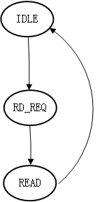
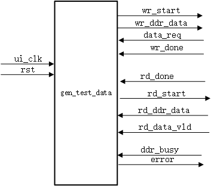

### 顶层模块：

|  端口名称   | I/O  | 位宽/bit |          备注          |
| :---------: | :--: | :------: | :--------------------: |
| wr_ddr_data |  I   |   256    |  用户写入的256bit数据  |
|  data_req   |  O   |    1     | 向上游模块请求数据信号 |
|  wr_start   |  I   |    1     |   一次写ddr开始信号    |
|   wr_done   |  O   |    1     |   一次写ddr结束信号    |
|  rd_start   |  I   |    1     |       读开始信号       |
| rd_data_vld |  O   |    1     |    读出数据有效信号    |
| rd_ddr_data |  O   |   256    |     读出的有效数据     |
|   rd_done   |  O   |    1     | 一次突发读数据结束信号 |
|  ddr_busy   |  O   |    1     | 当前控制器处于忙碌状态 |

### 用户写控制模块：

|   端口名称   | I/O  | 位宽/bit |                  备注                   |
| :----------: | :--: | :------: | :-------------------------------------: |
|    ui_clk    |  I   |    1     |          系统时钟(100MHz为例)           |
|     rst      |  I   |    1     |            系统复位,同步复位            |
|   wr_start   |  I   |    1     |               写开始信号                |
| wr_ddr_data  |  I   |   256    |          用户写入的256bit数据           |
|   data_req   |  O   |    1     |         向上游模块请求数据信号          |
|   wr_busy    |  O   |    1     |               当前模块忙                |
|   wr_done    |  O   |    1     |             一次写结束信号              |
|    wr_req    |  O   |    1     |      写请求信号,提供给仲裁模块仲裁      |
|    wr_ack    |  I   |    1     |     写响应模块,仲裁模块给回的写响应     |
| app_wdf_mask |  O   |    32    |            32bit写入数据掩码            |
| app_wdf_data |  O   |   256    |              写入ddr的数据              |
| app_wdf_wren |  O   |    1     |          当前写入数据有效信号           |
| app_wdf_end  |  O   |    1     | 当前数据是ddr一次突发传输的最后一个数据 |
| app_wdf_rdy  |  I   |    1     |          当前MIG写数据通道空闲          |
|   app_rdy    |  I   |    1     |           当前MIG命令通道空闲           |
|   app_cmd    |  O   |    3     |            写数据命令3’b000             |
|    app_en    |  O   |    1     |              命令使能信号               |
|   app_addr   |  O   |    29    |            要访问的内存地址             |

**状态机**:在IDLE状态下，若接收到写开始信号wr_start，则进入写请求状态，同时产生写请求wr_req给到仲裁模块，若当前可以进行写操作，则仲裁模块将会给出一个写响应信号wr_ack，接收到响应过后将跳转如写数据状态，从上游模块请求数据并给出写命令和地址，把数据写入到DDR中。 

**写数据时序图**:

进入写状态后，将使能app_wdf_wren信号，于此同时data_req信号在app_wdf_wren和app_wdf_rdy同时有效时才为有效，从而向上游模块请求数据，在写模块中，一次写操作需要向上游模块请求64个256bit数据。app_en在app_wdf_wren一个周期后拉高，然后再app_rdy和app_en同时有效的时候，需要给出写入ddr的地址，写入ddr的地址每次需要增加8，这是因为我们写入的数据是256bit，而ddr内存一个地址的容量是32bit，一次写入256bit地址正好增加8。当全部64个数据写入完成后，将产生一个写结束信号，指示本次写操作已经完成。在写状态时，拉高wr_busy指示当前模块正处于写忙碌的状态。

### 用户读控制模块

|    端口名称     | I/O  | 位宽/bit |                备注                 |
| :-------------: | :--: | :------: | :---------------------------------: |
|     ui_clk      |  I   |    1     |      系统时钟（以100MHz为例）       |
|       rst       |  I   |    1     |         系统复位，同步复位          |
|    rd_start     |  I   |    1     |             读开始信号              |
|   rd_ddr_data   |  O   |   256    |           从ddr中读出数据           |
|   rd_data_vld   |  O   |    1     |          读出数据有效信号           |
|     rd_req      |  O   |    1     |  读请求信号，提供给仲裁模块做判断   |
|     rd_ack      |  I   |    1     | 读响应信号，仲裁模块对读请求得响应  |
|     rd_done     |  O   |    1     |         一次读操作完成信号          |
|     rd_busy     |  O   |    1     |       当前模正处于读忙碌状态        |
|     app_rdy     |  I   |    1     |      当前命令通道处于空闲状态       |
|     ap_addr     |  O   |    29    |           读ddr得内存地址           |
|     app_en      |  O   |    1     |           都命令有效信号            |
|     app_cmd     |  I   |    3     |          读ddr得命令3’b001          |
|   app_rd_data   |  I   |   256    |          从ddr中读出的数据          |
| app_rd_data_vld |  I   |    1     |      从ddr中读出数据的有效信号      |
| app_rd_data_end |  I   |    1     | 当前数据是ddr突发传输的最后一个数据 |

**状态机**：若在空闲状态下接收到写开始信号rd_start则状态跳转到写请求状态，并给出写读请求信号rd_req，若接收到仲裁模块给出的读响应信号rd_ack，则跳转入读数据状态，将数据从ddr中读出。当读完64个数据后跳转回空闲状态。

**时序**：

在读状态下，将使能app_en信号，同时开始计数当前给出了多少个命令，在读模块中，一次读操作同样对应了64个数据，这样就与前面的写模块具有相同的长度，能够在读写速度上匹配，避免读写的冲突。当读完全部64个数据后，将给出读结束信号rd_done指示本次读操作已经完成，本模块处于读状态时，将使能rd_busy信号，指示本模块当前正忙碌。

### 读写仲裁模块

| 端口名称 | I/O  | 位宽/bit |                备注                |
| :------: | :--: | :------: | :--------------------------------: |
|  wr_req  |  I   |    1     | 写数据请求，写控制模块给出的写请求 |
|  rd_req  |  I   |    1     | 读数据请求，读控制模块给出的写请求 |
|  ui_clk  |  I   |    1     |      系统时钟（以100MHz为例）      |
|   rst    |  I   |    1     |            系统同步复位            |
|  wr_ack  |  O   |    1     |     写响应，用以响应本次写操作     |
| wr_done  |  I   |    1     |           一次写操作完成           |
|  rd_ack  |  O   |    1     |     读响应，用以响应本次读操作     |
| rd_done  |  I   |    1     |           一次读操作完成           |

**状态机**：在仲裁状态ARBIT下若接收到读请求，则进入读状态，若接收到写请求，则进入写状态，若读写请求同时出现则优先响应写请求进入写状态，当在读写状态中接收到读写结束信号wr_done或者rd_done时，状态将回到仲裁状态。

**时序**：

### TestBench

负责对DDR进行循环读写,每次读写64个256bit数据,通过比较写入和读出的数据是否相同来判断ddr控制器是否正常工作.

**状态机**：

**时序图**：

